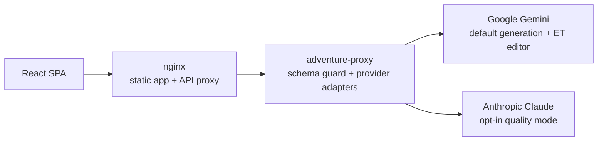

# AI Adventure Engine

AI Adventure Engine is a web-based party adventure game for 3-6 players, live
at [games.khe.ee/adventure](https://games.khe.ee/adventure/).

One person reads the story aloud, the group debates the next move, and the AI
continues the adventure. The game is designed for a real table: fast setup,
private objectives, visible shared pressure, and short turns that keep the room
moving.

## Why This Project Exists

This is both a playable game and a reference project for building AI-backed
consumer software with clear architecture boundaries.

The interesting parts are not just "call an LLM":

- AI output is constrained by canonical schemas and proxy-side allowlists.
- Game mechanics are app-owned; the model narrates, but the engine applies
  parameter state and secret scoring.
- Cost is a product requirement, so Gemini 2.5 Flash is the default and Claude
  is hidden as an opt-in quality mode.
- Estonian prose gets a separate editor pass because good local language quality
  matters more than raw model impressiveness.
- Prompt design, model selection, and API contracts are documented as first-class
  engineering decisions.

## Product Shape

Setup is split into four focused steps:

1. Adventure direction: genre and game length
2. The group: player count and optional names
3. Place and tone
4. Optional final detail with a setup review

During play, the group sees:

- a narrated scene
- three group-facing choices
- shared story parameters with visual state
- a separate "use special ability" action
- private secret goals revealed through a pass-the-phone ritual
- final scoring that shows who achieved their hidden objective

## Architecture At A Glance



The browser never calls AI providers directly. All generation goes through the
Node proxy, which owns provider keys, validates request signatures, enforces an
exact schema hash allowlist, and logs model telemetry.

## Stack

- React 19, TypeScript, Vite
- Tailwind CSS v4 with a hand-written app design layer in `src/index.css`
- Zustand for client state
- Node.js / Express proxy for AI provider access
- Gemini 2.5 Flash as the default live model
- Claude Sonnet 4.6 as an opt-in quality mode
- GitHub Actions self-hosted runner for deployment
- nginx behind Cloudflare Tunnel on a homelab VM

## Documentation

Start here:

- [Documentation index](docs/README.md)
- [Architecture](docs/ARCHITECTURE.md)
- [API contract](docs/api-contract.md)
- [Architecture decision records](docs/decisions/README.md)
- [UI/UX notes](docs/ui-ux.md)
- [Model strategy](docs/model-strategy.md)
- [Prompt audit](docs/prompt-audit.md)
- [Roadmap](ROADMAP.md)

## Local Development

```bash
npm install
npm run dev
```

The dev build proxies `/adventure/api/` to the production endpoint by default.
For local or live-proxy smoke tests, the frontend and proxy HMAC secrets must
match.

For UI testing without spending model credits, open the setup screen's `AI`
panel and choose `Mock`. The mock provider runs entirely in the browser API
layer, returns the same story/turn/sequel response shapes as the live providers,
and supports a long six-player flow for layout and pass-the-phone testing.

Repeat the same mock UI flow headlessly with Playwright:

```bash
npm run ui:smoke
```

Against an already-running Vite server:

```bash
PLAYWRIGHT_BASE_URL=http://127.0.0.1:5182 npm run ui:smoke
```

One-off signed smoke test against the live proxy:

```bash
API_SECRET="$(ssh khe@192.168.0.11 'cd /home/khe/homelab/services/apps/games && set -a && . ./.env && printf %s "$API_SECRET"')" npm run proxy:smoke
```

Run the local frontend against the live proxy:

```bash
VITE_API_SECRET="$(ssh khe@192.168.0.11 'cd /home/khe/homelab/services/apps/games && set -a && . ./.env && printf %s "$API_SECRET"')" npm run dev
```

## Quality Gates

Before shipping prompt, contract, or proxy changes:

```bash
npm run lint
npm run build
npm run ui:smoke
npm run schema:hashes
node --check proxy/server.js
```

`npm run lint` uses type-aware TypeScript rules, and `npm run build` runs the
strict app and Node TypeScript configs.

For gameplay quality, use the headless runner:

```bash
npm run playtest -- --genre=Thriller --duration=Short --language=et
```

The rubric is in [docs/prompt-audit.md](docs/prompt-audit.md). Model changes
should be judged by transcripts and proxy telemetry, not by one attractive run.

## Deployment

Every push to `main` triggers the self-hosted GitHub Actions runner on the
homelab VM. The workflow pins Node 24, installs with `npm ci`, runs the quality
gate above, publishes static assets to the games nginx mount, builds the proxy
image from its lockfile, and restarts the `adventure-proxy` container.

Infrastructure orchestration lives in
[khe-homelab](https://github.com/khelias/khe-homelab); this repo owns the app,
proxy, prompts, contracts, and product documentation.
