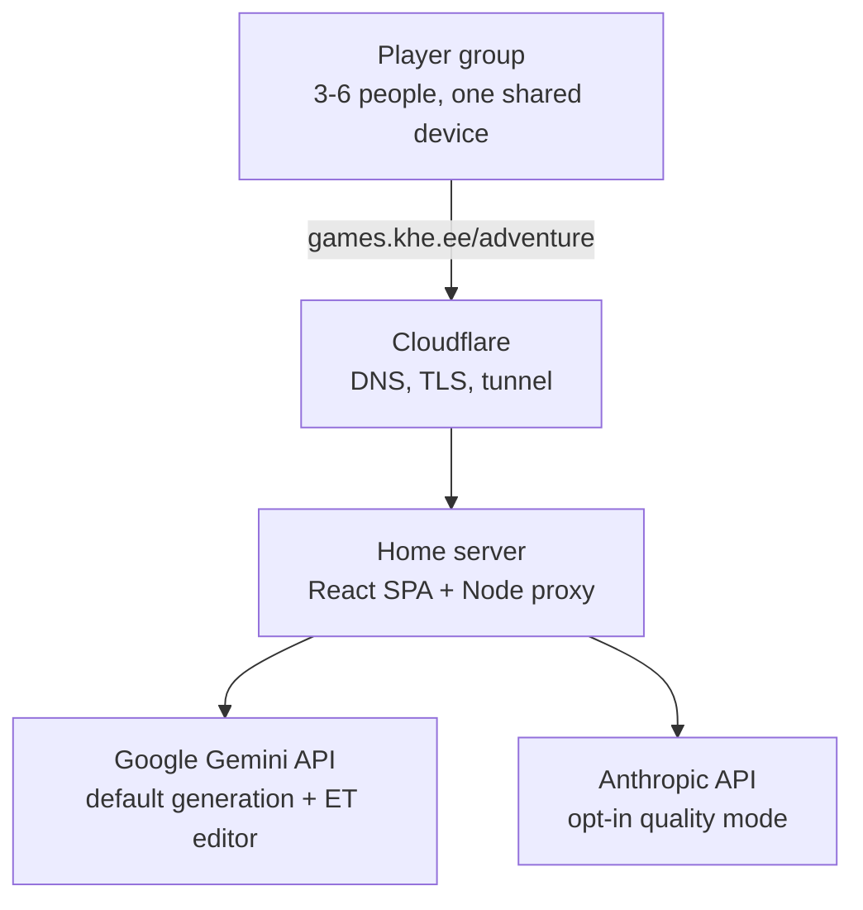
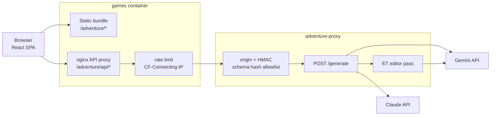
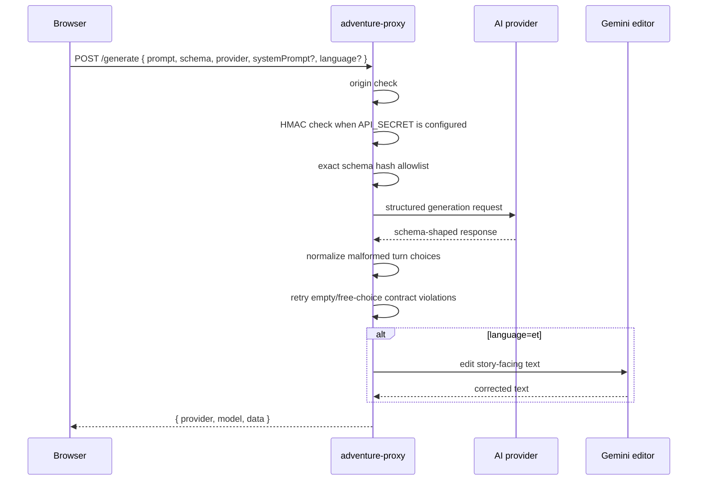
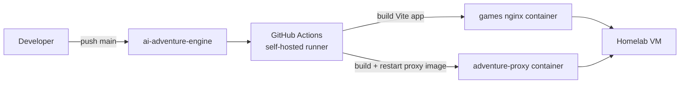

# Architecture

Last reviewed: 2026-04-25

AI Adventure Engine is a single-page React app plus a small provider proxy. The
core architectural decision is that the app owns game state and the AI owns
narration. The model may propose parameter changes and choices, but deterministic
client code applies state transitions, scores secrets, and decides when a game
ends.

## Architectural Goals

- **Playable at a table**: short setup, low turn latency, no account system, no
  multiplayer coordination overhead.
- **Bounded AI surface**: every AI response must match one of the canonical game
  schemas.
- **Cost-aware defaults**: Gemini 2.5 Flash is the live default; expensive models
  are opt-in.
- **Good Estonian output**: generated Estonian text is edited by a dedicated
  Gemini editor pass.
- **Simple deployment**: frontend and proxy deploy from one repo to the homelab
  games stack.

## System Context



The browser never receives provider API keys and never calls providers directly.
All AI traffic goes through `adventure-proxy`.

## Runtime Containers



## Main Request Flow



The proxy logs provider, model, schema name, latency, token counts, retry counts,
editor time, Gemini thinking tokens, and Gemini cache hits when available.

## Frontend State Ownership

The frontend uses Zustand for session state. Important ownership boundaries:

| Concern | Owner |
|---|---|
| Current screen, setup inputs, selected provider | App |
| Role ids and ability-used flags | App |
| Parameter current state index | App |
| Secret assignment and scoring | App |
| Game transcript | App |
| Scene prose | AI |
| Choice text and declared expected changes | AI |
| Parameter consequence text | AI |
| Final narration | AI |

Normal offered choices are group-facing and must have `isAbility=false`.
Player-triggered special abilities are created by the app from the separate
ability panel and sent back as `isAbility=true`.

Secret goals are scored from core group pressures. `time` parameters are treated
as deadline context, not personal win-condition targets, because progress clocks
can move in the opposite direction from the engine's best-to-worst parameter
contract.

Transcripts are browser-local analysis artifacts. The app persists the last 10
started games to `localStorage`, updates the active transcript after each turn,
and exposes a JSON download on the game-over screen. There is no centralized
gameplay logging unless an explicit opt-in pipeline is added later.

## Prompt And Schema Structure

Prompts live in `src/game/prompts/`.

| File | Responsibility |
|---|---|
| `schemas.ts` | Canonical response schemas and `TurnResponse` |
| `story-gen.ts` | Story, custom story, and sequel generation prompts |
| `turn.ts` | Turn prompt composer |
| `craft.ts` | Scene, choice, and parameter movement guidance |
| `contract.ts` | Strict turn response shape contract |
| `archetypes.ts` | Parameter archetypes and behavior rules |
| `phases.ts` | Story phase calculation and phase instructions |
| `tone.ts` | Mood/tone blocks |

The proxy allowlist is based on canonical schema hashes, not top-level key
fingerprints. After changing `src/game/prompts/schemas.ts`, run:

```bash
npm run schema:hashes
```

Then copy changed hashes into `proxy/server.js` and update
[api-contract.md](./api-contract.md).

## Turn Mechanics

One turn has three steps:

1. The player chooses a normal option, types a custom action, or spends a
   special ability.
2. The engine applies authoritative parameter changes:
   - for normal offered choices, `choice.expectedChanges`
   - for kickoff, custom actions, and special abilities, `response.parameters`
3. The AI response supplies the next scene, visible consequences, and the next
   three choices.

If one parameter reaches its worst state, the story continues with that collapse
as pressure. If two or more parameters are at worst, the engine asks the AI for a
forced ending using `forceEnd='unrecoverable'`.

## Reliability Guardrails

The model is expected to return either:

- a continuing turn with three choices and `gameOver=false`
- an ending turn with no choices, `gameOver=true`, and `gameOverText`

The proxy still defends against drift:

- non-array `choices` are coerced to `[]`
- empty choices with `gameOver=false` trigger two retries
- if retries fail, the proxy coerces `gameOver=true`
- continuing choices with no negative expected cost trigger retries
- normal choices marked `isAbility=true` are treated as contract violations

These guardrails keep one bad provider response from freezing the game.

## Security Posture

Controls:

1. nginx rate limit per visitor
2. origin/referer check in the proxy
3. HMAC request signature when `API_SECRET` is configured
4. exact schema hash allowlist
5. provider API keys stored only in server-side environment

Limitations:

- `VITE_API_SECRET` is bundled into the browser, so HMAC is a friction layer,
  not a true secret.
- Origin can be spoofed by a determined caller.
- The acceptable threat model is "public game endpoint with bounded game-shaped
  calls", not "untrusted general-purpose AI gateway".

## Deployment

Both frontend and proxy ship from this repo.



The homelab repository owns Docker Compose orchestration, nginx config, network
wiring, and environment values. This repo owns the application, proxy code,
prompts, schemas, and documentation.

## Code Map

| Concern | Path |
|---|---|
| App shell and screen routing | `src/App.tsx`, `src/components/GameViews.tsx` |
| Setup UI | `src/components/SetupScreen.tsx` |
| Gameplay UI | `src/components/GameScreen.tsx` |
| Secrets UI | `src/components/SecretAssignmentScreen.tsx`, `src/components/GameOverScreen.tsx` |
| Client state | `src/store/gameStore.ts` |
| Game mechanics | `src/game/engine.ts`, `src/game/actions.ts`, `src/game/secrets.ts` |
| Prompt modules | `src/game/prompts/` |
| API client | `src/api/adventure.ts` |
| Provider proxy | `proxy/server.js` |
| Headless playtest | `scripts/playtest.ts` |

## Related Documents

- [API contract](./api-contract.md)
- [Model strategy](./model-strategy.md)
- [Prompt audit](./prompt-audit.md)
- [Game systems audit](./game-systems-audit.md)
