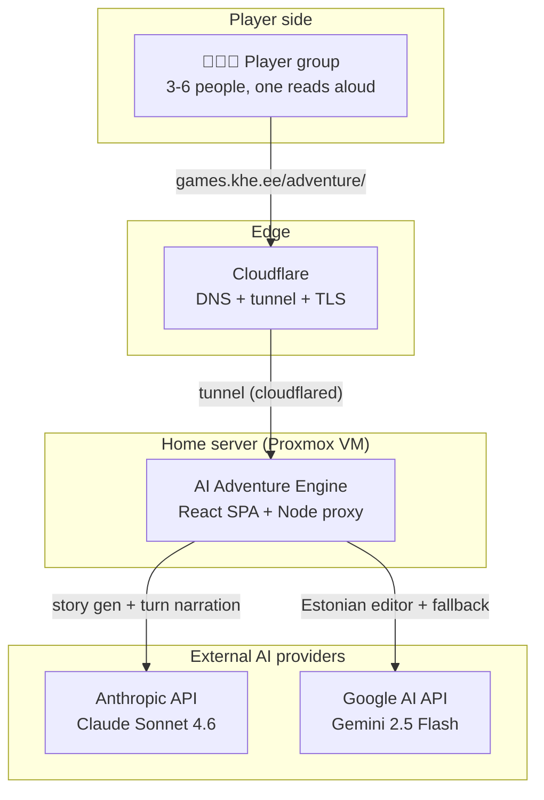
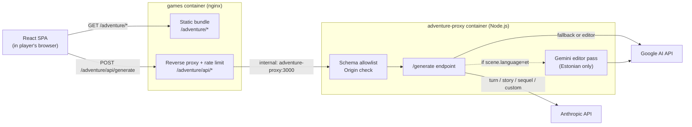
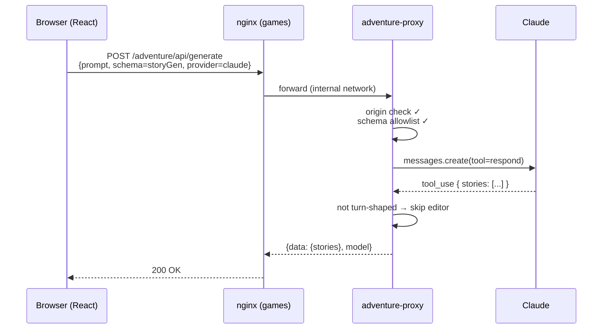
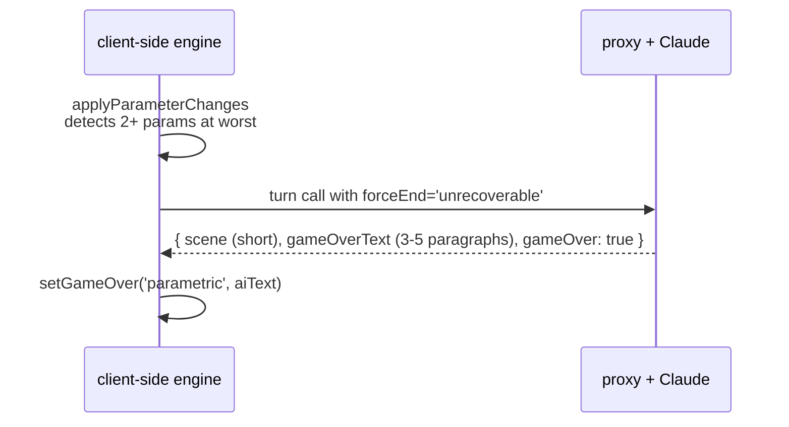
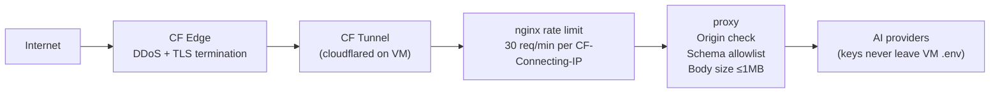
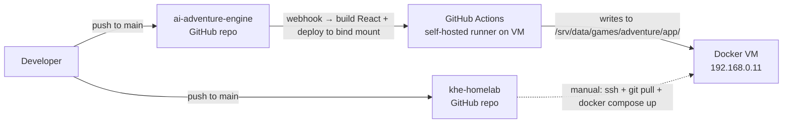

# Architecture

Reference document for how the AI Adventure Engine fits together. Start with [the README](../README.md) for what the game is.

Diagrams use Mermaid — GitHub renders them inline.

## 1. System context



The group's browser never talks to Anthropic or Google directly — every AI call goes through the home-server proxy, which holds the API keys and enforces schema + origin rules.

## 2. Containers



- **Browser**: React 19 + Vite + Zustand SPA. Built once, served as static files.
- **nginx (games container)**: serves the bundle, reverse-proxies `/adventure/api/` to the proxy container, enforces per-visitor rate limit (30 req/min keyed on `CF-Connecting-IP`).
- **adventure-proxy (Node.js)**: the only place holding API keys. Validates origin + schema shape, calls Claude or Gemini, optionally routes the response through an Estonian editor pass. Logs choice-cost violations as telemetry.
- **Cloudflare Tunnel**: a separate `cloudflared` container (in the homelab's `core/cloudflare-tunnel` stack) publishes `games.khe.ee` to the internet. No ports exposed from the VM directly.

## 3. Request flows

### 3a. Story generation (game setup)



Story gen is a single Claude call. No editor pass (different schema shape). Typical cost: ~$0.02, ~15-20s latency.

### 3b. Turn (the hot path)

```mermaid
sequenceDiagram
    participant UI as Browser (React)
    participant P as adventure-proxy
    participant C as Claude
    participant G as Gemini (editor)

    UI->>P: POST /generate<br/>{prompt=turnPrompt.user, schema=turn,<br/>systemPrompt=turnPrompt.system, language=et}
    P->>P: origin ✓ / schema ✓
    P->>C: messages.create(tool=respond)<br/>(system prompt cached via ephemeral)
    C-->>P: { scene, parameters, choices, gameOver }
    P->>P: log choice-cost violations
    alt language=et AND turn-shaped
        par editor scene
            P->>G: editorCall(scene)
            G-->>P: corrected
        and editor gameOverText (if present)
            P->>G: editorCall(gameOverText)
            G-->>P: corrected
        end
        Note over P,G: 25s shared budget;<br/>failures fall back to unedited
    end
    P-->>UI: {data: {scene, choices, ...}, model}
```

A turn is one Claude call + up to two parallel Gemini editor calls. The editor pass has a 25-second shared budget (one `AbortController` across both fields) so total response time stays below nginx's 120s ceiling even in the worst case.

### 3c. Narrative end (2+ parameters at worst)



Before this change (pre-2026-04-20), a single parameter at worst would trigger an engine-mechanical end with a hardcoded template string. Now: one parameter = phase transition (AI narrates consequence, game continues); two or more = dedicated finale Claude call, AI writes the ending. See [CHANGELOG.md](../CHANGELOG.md) for details.

## 4. Prompt architecture

All prompts live in `src/game/prompts.ts`. There are four schemas — the proxy validates incoming requests against the top-level `properties` keys of these:

| Schema | Purpose | Shape fingerprint |
|---|---|---|
| `storyGenerationSchema` | Generate a story + roles + parameters | `stories` |
| `customStorySchema` | User-typed story idea → roles + params | `parameters,roles` |
| `sequelSchema` | Continue a finished game with new twist | `newAbilities,newParameters` |
| `turnSchema` | One turn: scene + param changes + choices + optional gameOver | `choices,gameOver,gameOverText,parameters,scene` |

The turn prompt is split into **system** (static — story, characters, parameters, core rules, few-shot example) and **user** (dynamic — current turn number, parameter states, recent scenes, last choice). Claude's `cache_control: { type: 'ephemeral' }` caches the system block across turns — cache hit saves ~50% of input tokens.

The system prompt encodes the design rules the AI must follow:

1. Scene length (2-3 sentences non-climax, 60-word cap)
2. Parameters as sensory detail, not metadata
3. Choices declare their cost (text and `expectedChanges` agree in sign)
4. Trilemma enforcement (3 choices touch 3 different parameter combinations)
5. No hidden rules (all parameter changes visible in choices)
6. Parameter change semantics (+1 = better toward best state)
7. Just-broke dramatization (new scene opens with narrative consequence)
8. Ability timing (rising or climax only)
9. Final-turn game-over handling

## 5. Cost model

Approximate per-game costs at Claude Sonnet 4.6 input $3/MTok, output $15/MTok, Gemini Flash input/output ~$0.075/$0.3 per MTok:

| Action | Claude call | Editor pass | Total |
|---|---|---|---|
| Story gen (once) | ~$0.02 | — | **~$0.02** |
| Turn (each) | ~$0.04 | ~$0.001 | **~$0.04** |
| Narrative end | ~$0.05 | ~$0.002 | **~$0.05** |

Per full game:
- **Short (8 turns)**: ~$0.35
- **Medium (15 turns)**: ~$0.65
- **Long (20 turns)**: ~$0.85

Monthly bill for moderate use (~30 games): **$10-25**. Anthropic prompt caching gets a 50-70% hit rate in practice (system prompt stable within a run), dropping bills proportionally.

## 6. Security boundaries



Three layered controls against abuse:

1. **nginx rate limit** — per-visitor via `$http_cf_connecting_ip` map (falls back to `$remote_addr` for direct LAN hits). Without the map, all CF-tunnel traffic would collapse to one counter.
2. **Origin check** in proxy — `Origin` or `Referer` must match `https://games.khe.ee` or a localhost dev origin. 403 otherwise. Filters casual curl abuse.
3. **Schema allowlist** in proxy — incoming `schema.properties` top-level keys must match one of the four known shapes. 400 otherwise. This is the single biggest protection: without it, the proxy is a free generic Claude/Gemini API.

What is **not** protected:
- Anyone who knows the API shape + spoofs `Origin: https://games.khe.ee` can still make game-shaped calls (bounded by rate limit). Acceptable threat model for a public share-link game.
- No CAPTCHA / bot check at the edge. If abuse materializes, Cloudflare Turnstile is the next layer.
- Anthropic API quota is the ultimate ceiling — set an account-level hard budget cap.

API keys live only in the VM's `.env` file, never in the repo or git history.

## 7. Deployment

Two repos, deployed from two places:



- **Frontend** (`ai-adventure-engine`): every push to `main` triggers a GitHub Actions runner on the VM. It builds the Vite bundle and writes to `/srv/data/games/adventure/app/` (bind-mounted into the games nginx container). No container restart needed — nginx serves the new files immediately. Old browser tabs get a `Cache-Control: no-cache` on HTML so they fetch the new bundle next navigation.

- **Proxy** (`khe-homelab/services/apps/games/adventure-proxy/`): manual deploy. After pushing changes, SSH to the VM, pull, and `docker compose up -d --build adventure-proxy`. Because Docker's build cache sometimes masks `COPY server.js` changes, use `--no-cache` or `--force-recreate` when the code change isn't picked up.

### Coupling note

The frontend and proxy must stay in sync on two things:
- **Schema shapes**: adding or changing a schema in `src/game/prompts.ts` requires updating `ALLOWED_SCHEMA_SHAPES` in the proxy. Forgetting this breaks the feature silently (the proxy returns 400).
- **Request body contract**: adding a new field that the proxy should respect (e.g. `language`) requires matching changes in `src/api/adventure.ts`.

Long-term: move the proxy into the `ai-adventure-engine` repo as a `proxy/` folder, build a Docker image via GitHub Actions, and have the homelab pull by tag. See the trade-off discussion in CLAUDE.md's adventure section.

## 8. Where to look for what

| Concern | File |
|---|---|
| Game rules / prompt authoring | `src/game/prompts.ts` |
| Parameter mechanics, gameOver detection | `src/game/engine.ts` |
| Turn orchestration, error handling | `src/game/actions.ts` |
| Proxy routing + editor pass + security | `khe-homelab/services/apps/games/adventure-proxy/server.js` |
| nginx rate limit + reverse proxy | `khe-homelab/services/apps/games/nginx.conf` |
| Full-game smoke test | `scripts/playtest.ts` — see [`scripts/README.md`](../scripts/README.md) |
| Design principles / invariants | `V2-PLAN.md` |
| What changed and when | [CHANGELOG.md](../CHANGELOG.md) |
