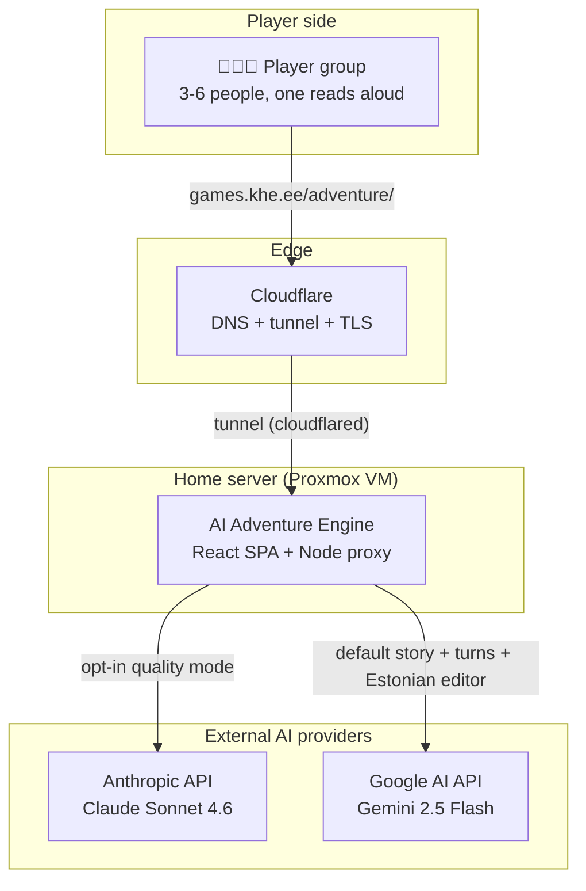
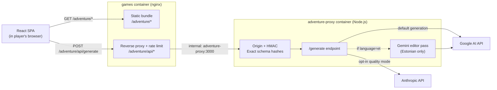
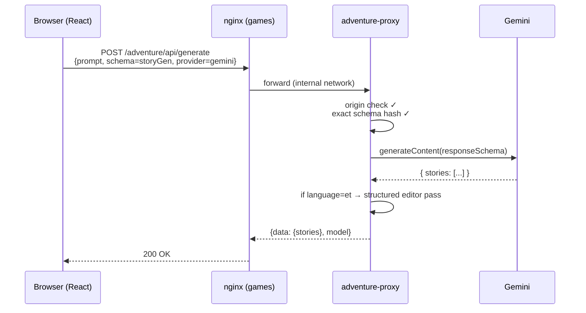
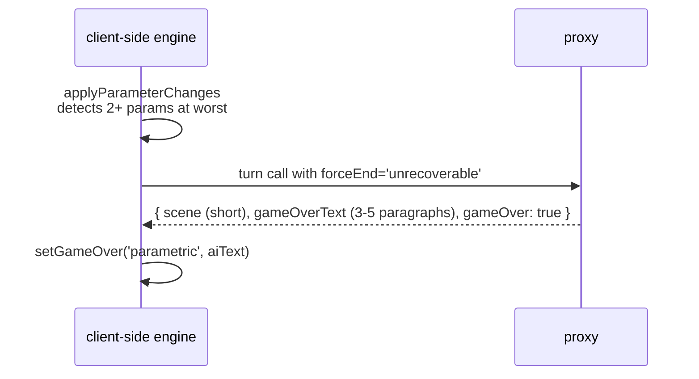
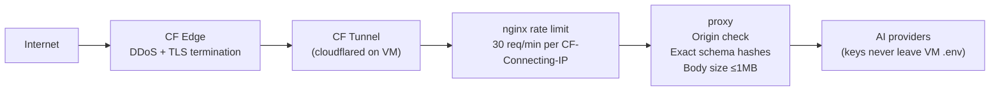
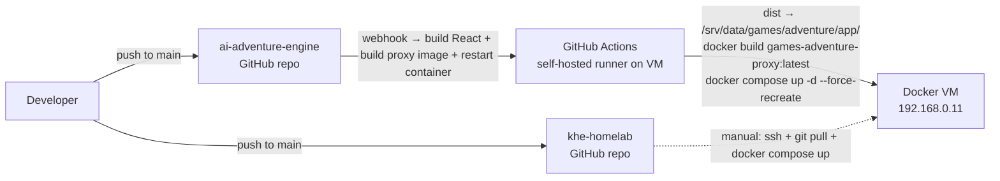

# Architecture

Reference document for how the AI Adventure Engine fits together. Start with [the README](../README.md) for what the game is.

Diagrams use Mermaid — GitHub renders them inline.

## 1. System context



The group's browser never talks to Anthropic or Google directly — every AI call goes through the home-server proxy, which holds the API keys and enforces schema + origin rules.

## 2. Containers



- **Browser**: React 19 + Vite + Zustand SPA. Built once, served as static files.
- **nginx (games container)**: serves the bundle, reverse-proxies `/adventure/api/` to the proxy container, enforces per-visitor rate limit (30 req/min keyed on `CF-Connecting-IP`).
- **adventure-proxy (Node.js)**: the only place holding provider API keys. Validates origin + exact schema hash + HMAC request signature, calls Gemini by default or Claude in opt-in quality mode, and optionally routes the response through an Estonian editor pass. Logs exact `in/out` token counts and choice-cost violations as telemetry.
- **Cloudflare Tunnel**: a separate `cloudflared` container (in the homelab's `core/cloudflare-tunnel` stack) publishes `games.khe.ee` to the internet. No ports exposed from the VM directly.

## 3. Request flows

### 3a. Story generation (game setup)



Story generation uses Gemini by default. Claude remains available only through
the hidden advanced provider picker. Estonian story/role/parameter text also
goes through the structured editor pass when `language=et`.

### 3b. Turn (the hot path)

```mermaid
sequenceDiagram
    participant UI as Browser (React)
    participant P as adventure-proxy
    participant G as Gemini
    participant GE as Gemini (editor)

    UI->>P: POST /generate<br/>{prompt=turnPrompt.user, schema=turn,<br/>systemPrompt=turnPrompt.system, language=et}
    P->>P: origin ✓ / schema hash ✓
    P->>G: generateContent(responseSchema)
    G-->>P: { scene, parameters, choices, consequences, gameOver }
    P->>P: retry empty/free-choice contract violations<br/>log choice-cost violations
    alt language=et AND turn-shaped
        par editor scene
            P->>GE: editorCall(scene)
            GE-->>P: corrected
        and editor gameOverText (if present)
            P->>GE: editorCall(gameOverText)
            GE-->>P: corrected
        and editor choices + consequences
            P->>GE: editorCall(choice/consequence text)
            GE-->>P: corrected
        end
        Note over P,GE: 25s shared budget;<br/>failures fall back to unedited
    end
    P-->>UI: {data: {scene, choices, ...}, model}
```

A turn is one provider call plus parallel Gemini editor calls for Estonian
story-facing text. The editor pass has a 25-second shared budget so total
response time stays below nginx's 120s ceiling even in the worst case.

### 3c. Narrative end (2+ parameters at worst)



One parameter at worst = phase transition (AI narrates the consequence, game continues); two or more at worst = dedicated finale provider call with `forceEnd: 'unrecoverable'`, AI writes the ending. The hardcoded template line in `translations.ts` is a fallback that fires only if this second call throws.

## 4. Prompt architecture

Prompts live in `src/game/prompts/` as a per-concern decomposition. The
public API (`storyGenerationPrompt`, `customStoryPrompt`, `sequelPrompt`,
`turnPrompt`, schemas, `getStoryPhase`) is re-exported from
`prompts/index.ts` so callers import unchanged.

Internal layout:

| File | Concern |
|---|---|
| `schemas.ts` | JSON schemas + `TurnResponse` type |
| `archetypes.ts` | 11-archetype palette + turn-time behavior rules + parameter-craft block |
| `phases.ts` | `getStoryPhase()` + per-phase narrative instruction |
| `tone.ts` | TONE blocks for light / tense / dark vibes |
| `craft.ts` | Scene / choices / parameter-movement craft + self-check |
| `contract.ts` | Output-shape contract (the "two narrative shapes" rule) |
| `story-gen.ts` | `storyGenerationPrompt` / `customStoryPrompt` / `sequelPrompt` |
| `turn.ts` | `turnPrompt({...}) → { system, user }` composer |
| `index.ts` | Public re-exports |

Four schemas; the proxy validates against exact canonical schema hashes:

| Schema | Purpose | Hash source |
|---|---|---|
| `storyGenerationSchema` | Generate a story + roles + parameters | `npm run schema:hashes` |
| `customStorySchema` | User-typed story idea → roles + params | `npm run schema:hashes` |
| `sequelSchema` | Continue a finished game with new twist | `npm run schema:hashes` |
| `turnSchema` | One turn: scene + param changes + consequences + choices + optional gameOver | `npm run schema:hashes` |

The turn prompt is split into **system** (static — story, characters,
parameters, archetype behaviors, craft + contract blocks, few-shot
example) and **user** (dynamic — current turn, parameter states, recent
scenes, last choice).

### CRAFT vs CONTRACT vs META

Three concerns are kept apart because models attend to each differently:

- **CRAFT** (`craft.ts`, `scene-craft`/`choices-craft`/`parameter-movement`):
  how to write the scene, the choices, the dialogue. Treated as creative
  direction. Positive declarative — *"a scene is 2-3 sentences"* — never
  imperative-negative.
- **CONTRACT** (`contract.ts`): the response *shape*. Phrased as a binary
  narrative choice: *"Your response resolves to ONE of two shapes. There
  is no third shape."* (3 choices + gameOver=false, or empty + gameOver=true
  + a full gameOverText.) The contract does not enumerate ending triggers —
  the engine handles forced endings via `forceEnd` blocks in the user
  message, and the contract only describes the AI-initiated case (rare).
- **META** (kept out of system prompt): app internals, what the engine
  does with the response. The model is a narrator, not the engine — telling
  it about engine behavior wastes attention.

### Parameter archetypes

11-shape palette: `resource`, `bond`, `pressure`, `secret`, `curse`,
`time`, `guilt`, `proof`, `promise`, `hunger`, `debt`. AI picks 3 different
archetypes per story (not the fixed RESOURCE+BOND+PRESSURE that earlier
versions defaulted to). Each parameter declares its archetype + optional
story states. Character-specific pressure is modeled through roles, secrets,
and ability anchors instead of parameter ownership.

### Empty-choices safety net

Even with the new contract framing, models can still emit
`choices: []` + `gameOver: false`. Proxy retries 2x with escalating
reminders, then coerces `gameOver=true` and synthesizes a minimal
gameOverText from the scene. Logs `retried=N` and `coerced-gameover`
when this fires — telemetry to track real-world drift rate.

## 5. Cost model

Gemini 2.5 Flash is the live default because this is a casual table game and
turn latency/cost matter more than premium prose. Claude Sonnet remains a
hidden opt-in quality mode.

Current source of truth: [`docs/model-strategy.md`](./model-strategy.md).

The proxy logs `in=`, `out=`, Gemini `thoughts=`, `total=`, cache hits,
retries, editor time, provider, model, and schema name. Model changes should
be made from transcript quality plus these logs, not from a single good or bad
manual run.

## 6. Security boundaries



Four layered controls against abuse:

1. **nginx rate limit** — per-visitor via `$http_cf_connecting_ip` map (falls back to `$remote_addr` for direct LAN hits). Without the map, all CF-tunnel traffic would collapse to one counter.
2. **HMAC Request Signature** in proxy — Requests carry `x-adventure-signature` generated by the client using `VITE_API_SECRET` and verified against the proxy's `API_SECRET`. This is a friction layer, not a true browser-side secret.
3. **Origin check** in proxy — `Origin` or `Referer` must match `https://games.khe.ee` or a localhost dev origin. 403 otherwise.
4. **Exact schema allowlist** in proxy — incoming schema must hash to one of the four canonical game schemas. 400 otherwise.

What is **not** protected:
- Anyone who knows the API shape, extracts the bundled signature secret, and spoofs `Origin: https://games.khe.ee` can still make game-shaped calls (bounded by rate limit and schema guard). Acceptable threat model for a public share-link game.
- No CAPTCHA / bot check at the edge. If abuse materializes, Cloudflare Turnstile is the next layer.
- Provider API quota is the ultimate ceiling — set account-level hard budget caps.

API keys live only in the VM's `.env` file, never in the repo or git history.

## 7. Deployment

Both frontend and proxy ship from this repo. `khe-homelab` only owns the compose orchestration (nginx config, container wiring, env).



- **Frontend + proxy** (`ai-adventure-engine`): every push to `main` triggers a GitHub Actions runner on the VM. The workflow (a) builds the Vite bundle and writes to `/srv/data/games/adventure/app/` (bind-mounted into the games nginx container — no restart needed), and (b) runs `docker build` on `proxy/` to produce `games-adventure-proxy:latest`, then `docker compose up -d --force-recreate adventure-proxy` to swap the container onto the new image. End-to-end push-to-live is ~20s.

- **Compose orchestration** (`khe-homelab`): manual deploy. `services/apps/games/docker-compose.yml` references `games-adventure-proxy:latest` by tag (no build context). Changes to nginx config, env vars, or network wiring still require `ssh + git pull + docker compose up -d` on the VM.

### Coupling note

Frontend and proxy live in the same repo, so schema/contract changes go in one commit:
- **Schema shapes**: adding or changing a schema in `src/game/prompts/schemas.ts`
  requires running `npm run schema:hashes` and updating `ALLOWED_SCHEMA_HASHES`
  in `proxy/server.js`. Forgetting this
  breaks the feature silently (proxy returns 400).
- **Request body contract**: adding a new field the proxy should respect
  (e.g. `language`) requires matching changes in `src/api/adventure.ts`.

## 8. Where to look for what

| Concern | File |
|---|---|
| Prompt authoring (CRAFT / CONTRACT / META) | `src/game/prompts/` modules |
| Parameter mechanics, gameOver detection | `src/game/engine.ts` |
| Secrets archetypes + scoring (client-only) | `src/game/secrets.ts` |
| Turn orchestration, error handling | `src/game/actions.ts` |
| Pass-the-phone secrets ritual UI | `src/components/SecretAssignmentScreen.tsx`, `src/components/GameOverScreen.tsx` (reveal flow) |
| Parameter board + ability panel | `src/components/GameScreen.tsx` |
| Proxy routing + editor pass + retry/coerce | `proxy/server.js` |
| nginx rate limit + reverse proxy | `khe-homelab/services/apps/games/nginx.conf` |
| Full-game smoke test (with secret simulation) | `scripts/playtest.ts` — see [`scripts/README.md`](../scripts/README.md) |
| API contract | [`docs/api-contract.md`](./api-contract.md) |
| Prompt audit rubric | [`docs/prompt-audit.md`](./prompt-audit.md) |
| Model strategy | [`docs/model-strategy.md`](./model-strategy.md) |
| Design principles / invariants, roadmap | [`ROADMAP.md`](../ROADMAP.md) |
